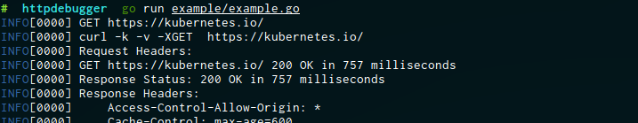

# httpdebugger

This is an [http.RoundTripper](https://golang.org/pkg/net/http/#RoundTripper) that will display information about the requests passing through it based on what is configured.

httpdebugger is created based on [k8s.io/client-go/transport/round_trippers.go](https://github.com/kubernetes/client-go/blob/master/transport/round_trippers.go)

## Example



```go
package main

import (
	"net/http"

	"github.com/sirupsen/logrus"
	"github.com/superbrothers/httpdebugger"
)

var log = logrus.New()

func main() {
	w := log.Writer()
	defer w.Close()

	client := &http.Client{
		Transport: httpdebugger.NewDebuggingRoundTripper(
			&http.Transport{},
			w,
			httpdebugger.JustURL,
			httpdebugger.URLTiming,
			httpdebugger.CurlCommand,
			httpdebugger.RequestHeaders,
			httpdebugger.ResponseStatus,
			httpdebugger.ResponseHeaders,
		),
	}

	if _, err := client.Get("https://kubernetes.io/"); err != nil {
		log.Fatal(err)
	}
}
```

## License

This software is released under the MIT License and includes the work that is distributed in the Apache License 2.0.
